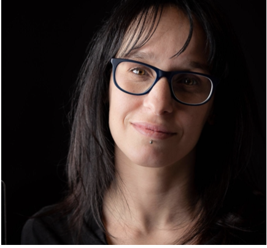

{:class="img-responsive"}

Federica is an Assistant Professor at the University of Delaware in the Departments of Physics and Astronomy and in the School of Public Policy and Administration and a Resident Faculty in the Data Science Institute. She works on data-driven solutions to problems that span from the nature of explosions in the sky to delays in the justice system. She studies lightcurves, time series of light, in astronomy to understand stellar evolution and cosmology, and in the urban environment at the Urban Observatory, where the study of urban lightcurves enables sociological, ecologic, economic inference. She is a TED 2019 fellow, a passionate
   communicator and educator. She has co-led the Rubin LSST Transients and Variable Stars Science Collaboration since 2015 and since 2017 she is the Coordinator for all eight Rubin LSST Science Collaborations.
