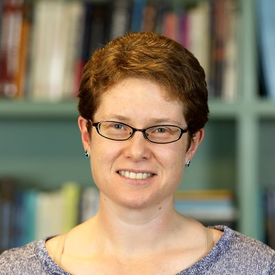

{:class="img-responsive"}

Rachel joined LCO as a post-doctoral scholar in 2007, and has since become a Staff Scientist. She specializes in the detection and characterization of exoplanets, initially as a founder member of the SuperWASP transit survey, for which she received the RAS Group AchievementAward. SincejoiningLCO,shebegantostudyexoplanetsvia the transient phenomena of microlensing, and now leads the microlensing group there. In the course of this research, she developed automated Target and Observation Management software (TOMs) to make observations through the LCO Network. This motivated her to lead the
TOM Toolkit project and Community Development Program, to make these powerful observing tools available to the community. Rachel was elected as co-chair of the Transients and Variable Stars Science Collaboration in 2017.
