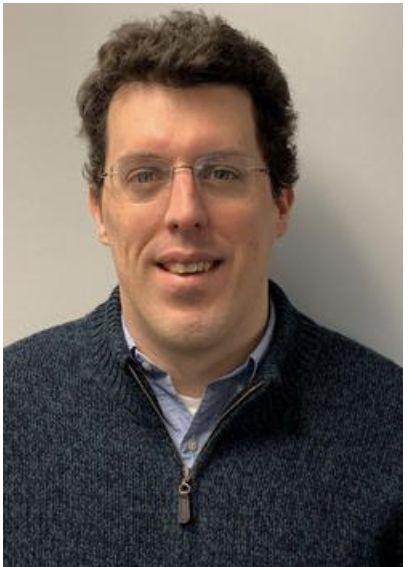

{:class="img-responsive"}

In 2013 Will joined the faculty at the University of Michigan-Dearborn, a regional comprehensive university near Detroit, Michigan. His main area of specialization is in novel uses of high-accuracy proper motions to probe the formation history of stellar populations within the inner Milky Way galaxy. His recent areas of interest include large-scale ground-based imaging surveys of the inner Milky Way galaxy. Will has been active in the LSST science community for a number of years, with particular focus on the LSST observing strategy for Galactic science. Will became a co-chair of the Stars, Milky Way & Local Volume (SMWLV) science collaboration in 2020.
